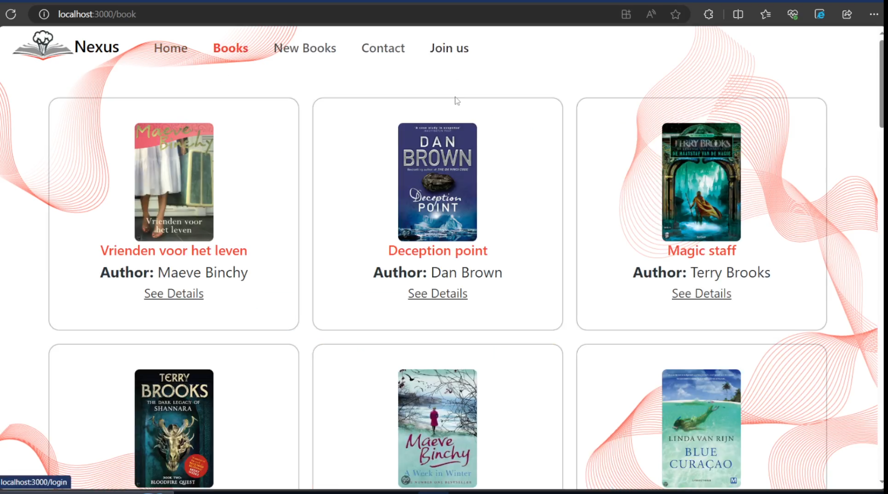
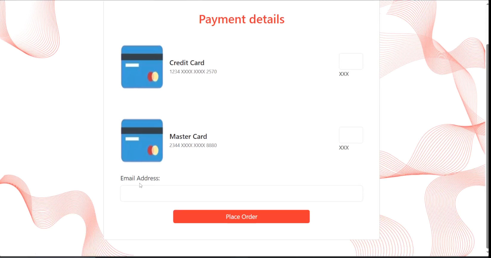

# NexusBooks

NexusBooks is a comprehensive platform for managing and exploring a collection of books. This project allows users to search for books, view details, and manage their personal library efficiently.








## Features

- Search for books by title, author, or ISBN.
- View detailed information about each book.
- Manage your personal book collection.
- Responsive design for mobile and desktop users.

## Installation

To get started with NexusBooks, follow these steps:

1. **Clone the repository**:
   ```bash
   git clone https://github.com/BassantMaher/NexusBooks.git

2. Navigate to the project directory:
    ```bash
    cd NexusBooks

3. Install dependencies:
    ```bash
    npm install

4. Run the application:
    ```bash
        npm start
## Usage
Once the application is running, you can access it at http://localhost:3000. From there, you can explore the features and manage your book collection.

## Contributers

- [Bassant Maher](https://github.com/BassantMaher)
- [Ayaat Mohammed](https://github.com/Ayat237)
- [Farah Elsokary](https://github.com/Farahelsoukary)
- [Alaa Raed](https://github.com/alaa-raed)